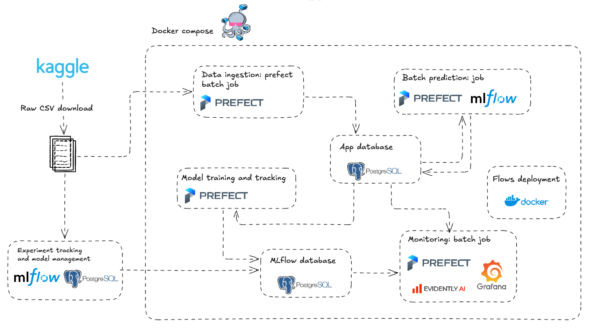

# 📦 Customer Churn Prediction – MLOps Project


## 🧠 Problem Overview

**Customer churn** occurs when users stop using a product or service. For subscription-based businesses, predicting churn is crucial to reduce revenue loss and improve customer retention.

This project addresses the **churn prediction** problem using machine learning, supported by a complete MLOps pipeline.

---

## 🚀 Solution Summary

This end-to-end project includes:

- **MLflow** for experiment tracking and model registry  
- **Prefect** for orchestrating key workflows:
  - Loading raw CSVs into **PostgreSQL**
  - **Training**, **prediction**, and **monitoring** flows

Everything is modular and production-ready, making it easy to manage, scale, and monitor over time.

---

## 🧭 Architecture Overview

The following diagram illustrates the high-level architecture of this MLOps project:



---

## 📊 Dataset

Based on [this Kaggle dataset](https://www.kaggle.com/datasets/safrin03/predictive-analytics-for-customer-churn-dataset/data), it includes features like:

- `AccountAge`, `MonthlyCharges`, `TotalCharges`
- User behavior: `ViewingHoursPerWeek`, `UserRating`, `WatchlistSize`
- Preferences: `GenrePreference`, `ContentType`, `SubscriptionType`
- Target: `Churn` (1 = churned, 0 = active)

## 📁 Project Structure

```
.
├──initdb                        # Postgres db initialization
    └── init-multi-db.sql        # SQL init script for PostgreSQL
├── data/                         # Place the Kaggle dataset here (after unzip)
├── grafana_provisioning/        # Grafana dashboards, datasources, alerting config
├── models/                      # Saved features and preprocessing artifacts
├── notebooks/                   # EDA and exploratory analysis notebooks
├── output/                      # Output files from model runs (optional)
├── reports/                     # Monitoring reports (drift, quality, performance)
├── src/customer_churn_mlops/    # Core Python package
│   ├── flows/                   # Prefect flows (ETL, training, inference, monitoring)
│   ├── inference/               # Inference logic
│   ├── training/                # Training utilities
│   └── utils/                   # Helper functions
├── .env.docker                  # Docker-specific environment variables
├── docker-compose.yaml          # Orchestration of all services
├── Dockerfile                   # Base image for custom tasks
├── Dockerfile.mlflow            # MLflow-specific Docker image
├── .python-version              # Python version for pyenv
├── poetry.lock / pyproject.toml # Dependency management (Poetry)
├── Makefile                     # Automation commands (build, run, clean, logs)
└── LICENSE
```

> ⚠️ **Important:**  
To run this project, download the dataset from [Kaggle](https://www.kaggle.com/datasets/safrin03/predictive-analytics-for-customer-churn-dataset/data), unzip it, and place the files in the `data/` folder.


## 🛠️ Installation

1. **Set Python version (using pyenv):**

Make sure you have `pyenv` installed. The required Python version is specified in `.python-version`.

```bash
pyenv install
pyenv local $(cat .python-version)
```

2. **Install dependencies with Poetry:**

```bash
poetry install
```

> Ensure you have Poetry installed: https://python-poetry.org/docs/#installation

---

## 🚀 Usage

### 🧱 Start all services (PostgreSQL, MLflow, Prefect, Grafana, etc.)

Use the `Makefile` commands:

```bash
make up             # Build and start all services
make down           # Stop all services
make down-volumes   # Stop and remove volumes and folders
make restart        # Rebuild and restart
make logs           # View logs
make ps             # Check container status
make clean          # Full cleanup (volumes, images, networks, folders)
```

Artifacts from MLflow are stored in `./mlartifacts`.

---

## 🌐 Service Access & Ports

After running `make up`, you can access the following services in your browser:

| Service       | URL                        | Description                        |
|---------------|----------------------------|------------------------------------|
| **MLflow**    | [http://localhost:5050](http://localhost:5050) | Experiment tracking & model registry |
| **Prefect UI**| [http://localhost:4200](http://localhost:4200) | Flow orchestration dashboard       |
| **Grafana**   | [http://localhost:3001](http://localhost:3001) | Monitoring dashboards              |

> Note: These ports are mapped in `docker-compose.yaml` and can be changed via the `.env.docker` file if needed.

### 🔌 Exposed Ports Summary

| Port | Service       | Host Mapping        |
|------|---------------|---------------------|
| 5432 | PostgreSQL    | `localhost:5432`    |
| 5050 | MLflow        | `localhost:5050`    |
| 4200 | Prefect UI    | `localhost:4200`    |
| 3000 | Prefect API   | `localhost:3000`    |
| 3001 | Grafana       | `localhost:3001`    |

---

### ▶️ Run flows

You can manually run any Prefect flow script using:

> ⚠️ **Important:**  
Manual runs will not be displayed in Prefect UI. It is recommended to run flows from Prefect UI.

```bash
poetry run python src/customer_churn_mlops/flows/<desired_flow>.py
```

Replace `<desired_flow>` with the actual flow filename, e.g.:

```bash
poetry run python src/customer_churn_mlops/flows/model_training_flow.py
```

---


